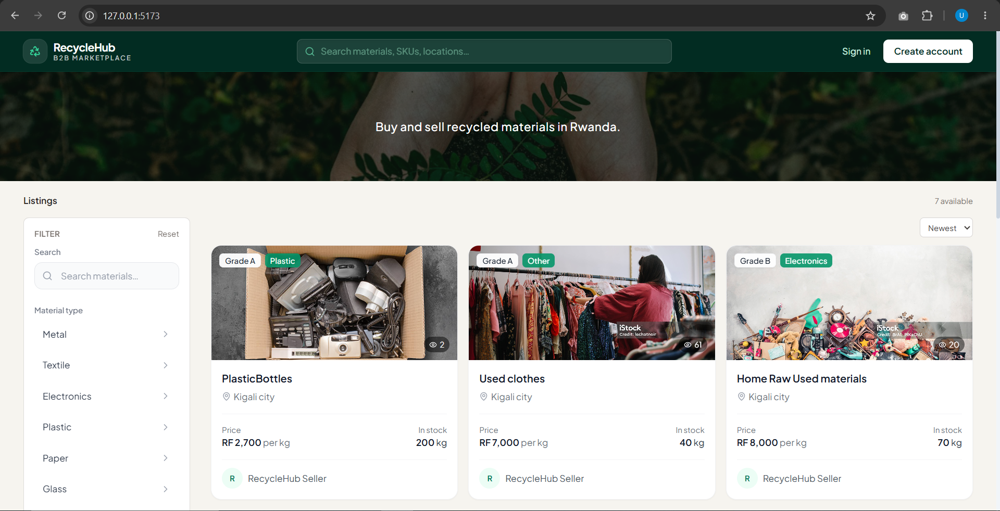
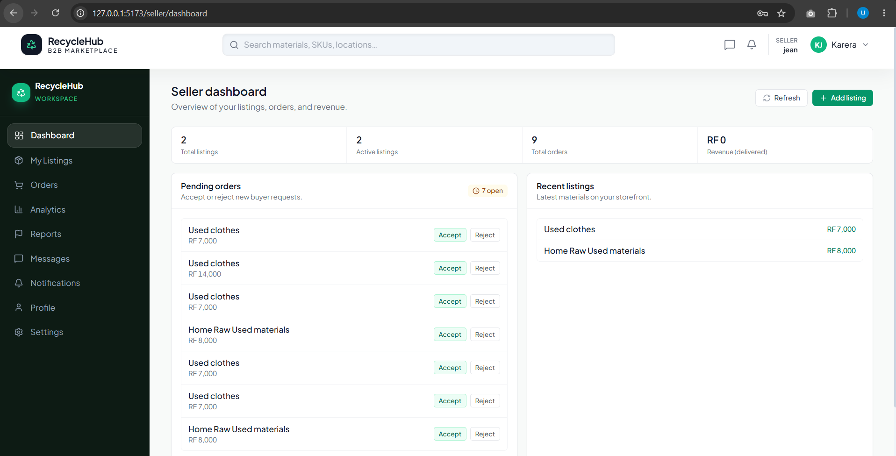
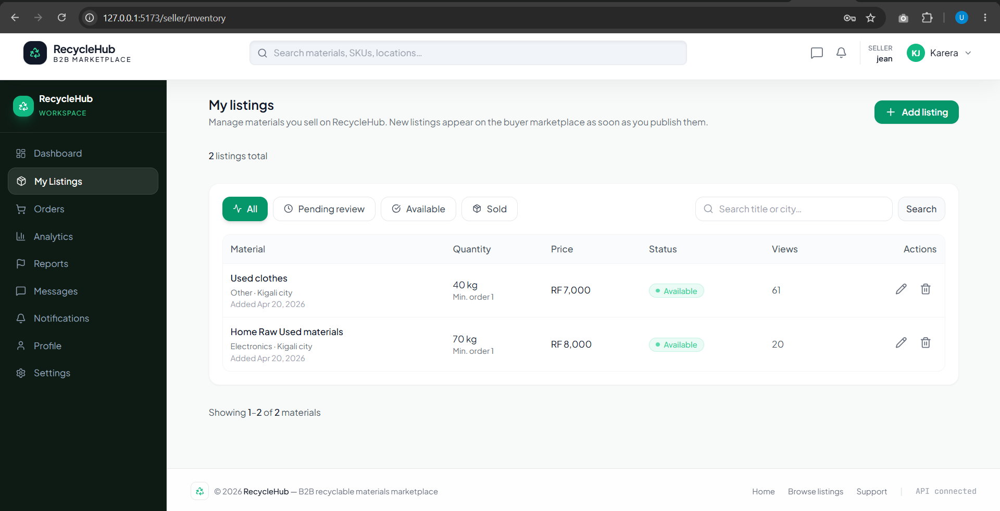
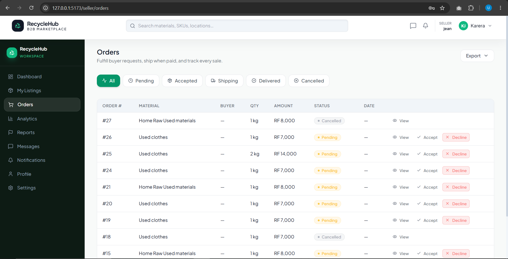
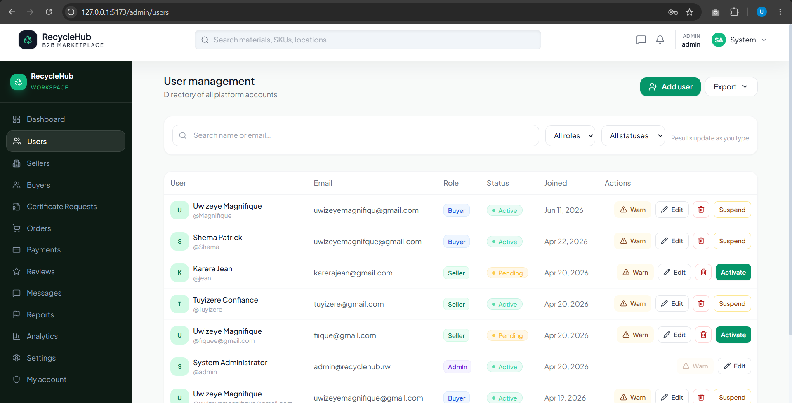
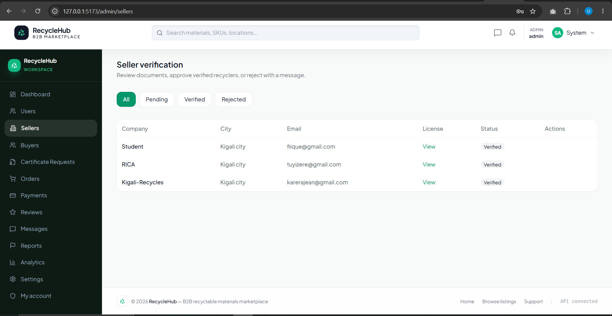
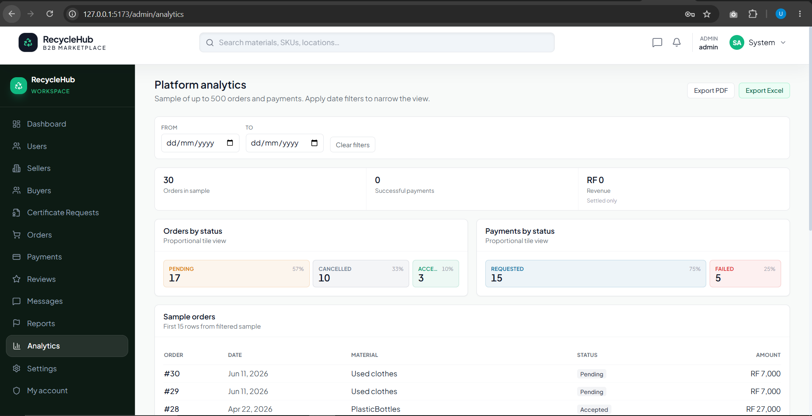
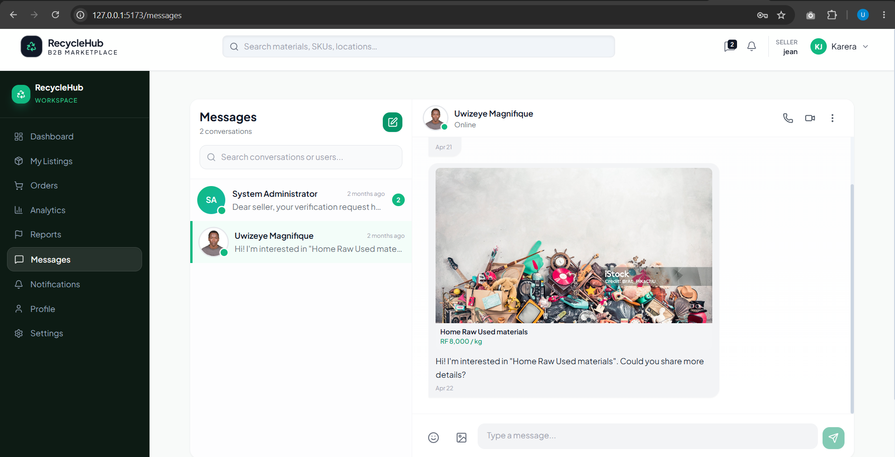

<div align="center">


<br/>

[](https://react.dev/)
[](https://dotnet.microsoft.com/)
[](https://www.microsoft.com/sql-server)
[](https://tailwindcss.com/)
[](https://vite.dev/)

<br/>

<p>
<strong>RecycleHub</strong> is a B2B marketplace for Rwanda and beyond. It connects businesses that have surplus or recycled materials
(plastics, metals, paper, industrial by-products) with buyers who need them — with verified listings, order tracking, in-app messaging,
and mobile-money checkout so every deal is traceable, not a guess.
</p>

<p>
<strong>Sellers</strong> publish inventory and fulfill orders. <strong>Buyers</strong> browse the marketplace, purchase materials, and pay through PawaPay.
<strong>Admins</strong> verify accounts, moderate reviews and reports, and monitor platform health — all from dedicated role-based workspaces.
</p>

<p>
<em>Developed using</em>
<strong>JavaScript (ES modules)</strong>, <strong>React 19</strong>, <strong>Vite</strong>, <strong>React Router</strong>, <strong>Tailwind CSS</strong>,
<strong>Axios</strong>, <strong>React Hook Form</strong>, and <strong>Zod</strong> on the frontend;
<strong>C#</strong>, <strong>ASP.NET Core 8</strong>, <strong>Entity Framework Core 8</strong>, <strong>SQL Server</strong>, <strong>JWT Bearer authentication</strong>,
<strong>SignalR</strong>, <strong>BCrypt</strong>, <strong>MailKit</strong>, and <strong>Swagger</strong> on the backend;
and <strong>PawaPay</strong> for MTN MoMo payments in Rwanda.
</p>

<br/>

[](#why-recyclehub-exists)
[](#what-the-system-does)
[](#screenshots)
[](#architecture)
[](#run-locally)

</div>

<br/>

---

## 𝚆𝚑𝚢 𝚁𝚎𝚌𝚢𝚌𝚕𝚎𝙷𝚞𝚋 𝙴𝚡𝚒𝚜𝚝𝚜

Waste is not only an environmental problem — it is a **coordination problem**. Businesses with usable scrap, offcuts, or processed recyclables often struggle to find reliable buyers. Buyers who need materials at a fair price do not always know where to look.

**RecycleHub closes that gap** with a role-based platform for discovery, ordering, mobile-money payments, messaging, and governance — so recycling becomes a **traceable transaction**, not a guess.

<br/>

---

## 𝚆𝚑𝚊𝚝 𝚝𝚑𝚎 𝚂𝚢𝚜𝚝𝚎𝚖 𝙳𝚘𝚎𝚜

| Role | Capabilities |
|---|---|
| **Visitors** | Browse the public homepage and live listings without signing in. |
| **Buyers** | Marketplace, orders, PawaPay mobile money, order tracking, SmartSwap-style matching, messaging. |
| **Sellers** | Inventory, order acceptance, analytics, revenue overview, reports. |
| **Admins** | User/seller/buyer management, payments & orders overview, review moderation, platform analytics, certificates, community reports. |

Everyone with an account gets **profile**, **settings**, **messages**, and **real-time notifications** (SignalR).

<br/>

---

## 𝚂𝚌𝚛𝚎𝚎𝚗𝚜𝚑𝚘𝚝𝚜

A visual walkthrough of RecycleHub across every role and experience.

<br/>

### Public Homepage

The landing page shows a compact hero and live listings so visitors see materials immediately.

<div align="center">

</div>

<br/>

---

### Buyer Experience

Buyers browse verified listings, open material details, place orders, and pay through integrated mobile money.

<table width="100%">
<tr>
<td width="33%" align="center" valign="top">

**Marketplace**


<sub>Browse and discover verified recycled material listings.</sub>

</td>
<td width="33%" align="center" valign="top">

**Checkout Flow**


<sub>Review order details and confirm the purchase.</sub>

</td>
<td width="33%" align="center" valign="top">

**Payment**


<sub>Complete payment via PawaPay mobile money integration.</sub>

</td>
</tr>
</table>

<br/>

---

### Seller Experience

Sellers manage listings, review incoming orders, and track performance from a dedicated workspace.

<table width="100%">
<tr>
<td width="33%" align="center" valign="top">

**Dashboard**



<sub>Overview of revenue, activity, and performance metrics.</sub>

</td>
<td width="33%" align="center" valign="top">

**Listings**



<sub>Create and manage material listings with pricing and stock.</sub>

</td>
<td width="33%" align="center" valign="top">

**Orders from Buyers**



<sub>Review, accept, and fulfill incoming buyer orders.</sub>

</td>
</tr>
</table>

<br/>

---

### Admin Experience

Admins monitor users, verify sellers, and review platform-wide analytics.

<table width="100%">
<tr>
<td width="33%" align="center" valign="top">

**User Management**



<sub>View, verify, and manage all registered platform users.</sub>

</td>
<td width="33%" align="center" valign="top">

**Seller Management**



<sub>Approve sellers, review profiles, and enforce platform standards.</sub>

</td>
<td width="33%" align="center" valign="top">

**Platform Analytics**



<sub>System-wide data on orders, revenue, users, and activity.</sub>

</td>
</tr>
</table>

<br/>

---

### Shared: Messaging

Buyers, sellers, and admins can message each other in-app for order follow-up and support.

<div align="center">

</div>

<br/>

---

## 𝙰𝚛𝚌𝚑𝚒𝚝𝚎𝚌𝚝𝚞𝚛𝚎

```
[ React SPA ]  --HTTPS + JWT-->  [ RecycleHub.API ]  --EF Core-->  [ SQL Server ]
       ^                                    |
       +------------ SignalR (notifications) --+
```

1. **Frontend** — React 19 + Vite, role-based routes (public, buyer, seller, admin, shared).
2. **API** — ASP.NET Core 8 REST + SignalR, JWT auth, BCrypt passwords, MailKit OTP when SMTP is configured.
3. **Database** — SQL Server via EF Core; reference SQL scripts live under `RecycleHub.API/Database/`.
4. **Payments** — PawaPay (MTN MoMo Rwanda) configured in `appsettings` / user secrets.
5. **Files** — Uploads served from API `wwwroot` in local development.

<br/>

---

## 𝚃𝚎𝚌𝚑 𝚂𝚝𝚊𝚌𝚔

| Layer | Technologies |
|---|---|
| **Frontend** |       |
| **Backend** |       |
| **Payments** |  |

<br/>

---

## 𝚁𝚎𝚙𝚘𝚜𝚒𝚝𝚘𝚛𝚢 𝙻𝚊𝚢𝚘𝚞𝚝

| Path | Description |
|---|---|
| `RecycleHub.API/` | Web API, models, services, controllers, SignalR hubs |
| `recyclehub-frontend/` | React SPA |
| `Screenshots/` | UI documentation images for this README |
| `RecycleHub.API/Database/` | SQL schema / procedure reference scripts |
| `Tools/PasswordHash/` | Dev helper for generating BCrypt hashes |

<br/>

---

## 𝙿𝚛𝚎𝚛𝚎𝚚𝚞𝚒𝚜𝚒𝚝𝚎𝚜


- [.NET 8 SDK](https://dotnet.microsoft.com/download/dotnet/8.0)
- [Node.js](https://nodejs.org/) (LTS) and npm
- **SQL Server** (LocalDB, Express, or full instance)

<br/>

---

## 𝙲𝚘𝚗𝚏𝚒𝚐𝚞𝚛𝚊𝚝𝚒𝚘𝚗

### API

1. Set `ConnectionStrings:DefaultConnection` in `appsettings.Development.json` or user secrets.
2. Configure **JWT**, **PawaPay**, and **Email/SMTP** (for OTP) — never commit real secrets.

### Frontend

1. Copy `recyclehub-frontend/.env.example` to `.env.development`.
2. Set `VITE_API_BASE_URL` to your API (default local: `http://127.0.0.1:5123`).

<br/>

---

## 𝚁𝚞𝚗 𝙻𝚘𝚌𝚊𝚕𝚕𝚢

**Terminal 1 — API**

```bash
cd RecycleHub.API
dotnet run --launch-profile http
```

**Terminal 2 — Frontend**

```bash
cd recyclehub-frontend
npm install
npm start
```

> Open **http://127.0.0.1:5173**. Keep both processes running. Swagger is available on the API port when enabled.

<br/>

---

## 𝚃𝚎𝚊𝚖 & 𝙲𝚘𝚕𝚕𝚊𝚋𝚘𝚛𝚊𝚝𝚒𝚘𝚗

**Remote:** [github.com/MagnifiqueUwizeye01/Recyclehub](https://github.com/MagnifiqueUwizeye01/Recyclehub)

| GitHub | Role |
|---|---|
| MagnifiqueUwizeye01 | Project lead |
| Welvarine | Backend & integration |
| lington-123 | Frontend & UX |
| Belise201 | Admin & moderation features |
| Raissa427 | Buyer/seller flows & payments |

<br/>

---

<div align="center">

Built with ♻️ for a circular economy

<br/>


</div>
